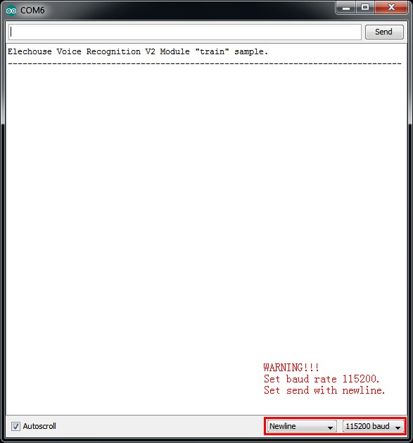
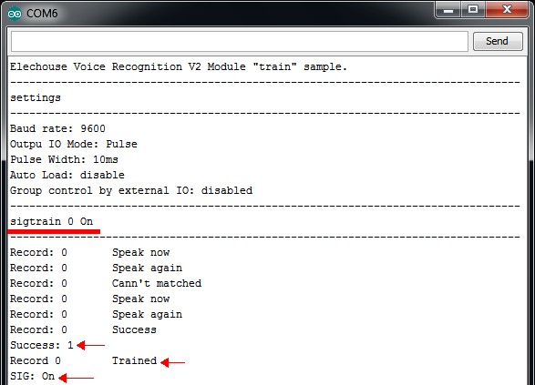
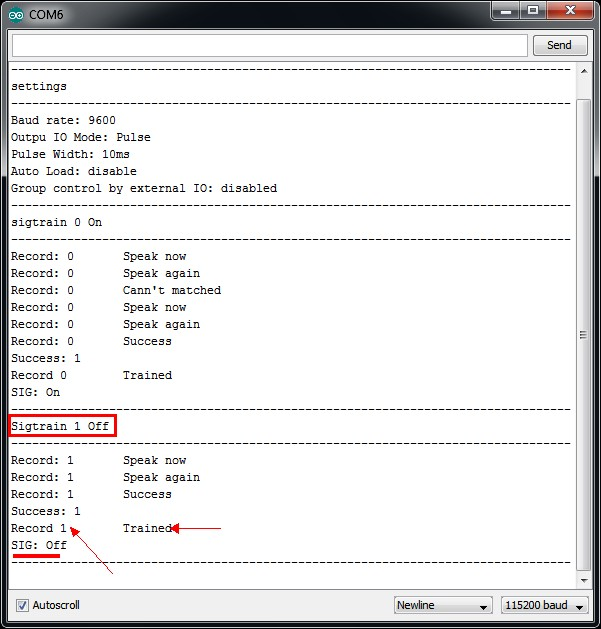
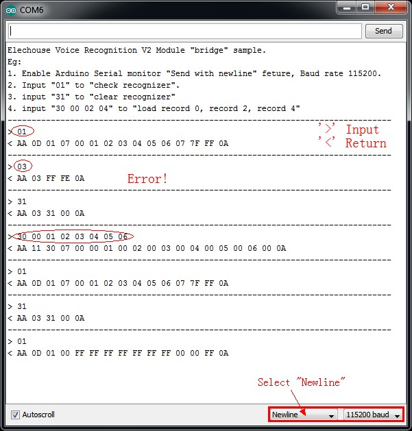
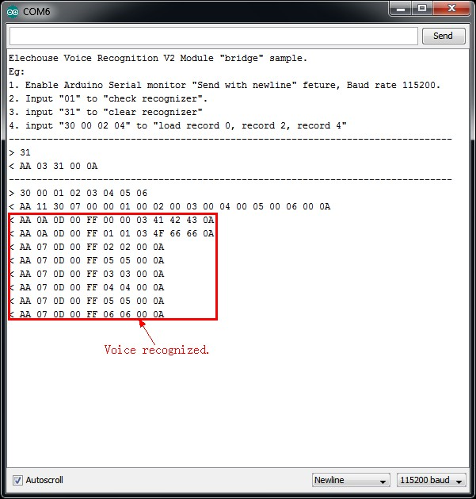
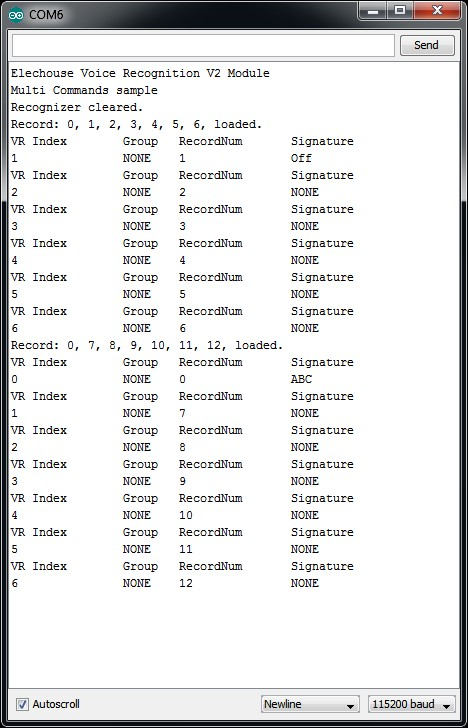

# Voice Recognition V2 **(WIP)**
[START]: #voice-recognition-v2-wip

## Feature
- Recognize maximum 7 voice commands at same time
- Store maximum 80 records of voice
- Group control and external group select pin
- Auto load records when power on
- Signature function, help to make out voice record
- LED indicate

## Introduce

## Terminology
- **recognizer** -- core part of voice recognition module
- **recognizer index** -- Each VoiceRecognitionModule support 7 voice command, recognizer has 7 region for each voice command, one index corresponds to one region
- **train** -- let VoiceRecognitionModule record your voice command
- **load** -- copy trained voice to recognizer of VoiceRecognitionModule
- **record** -- the trained voice command store in flash, number from 0 to 79
- **signature** -- alias for **record**
- **group** -- help to manage records, each group 7 **records**. System group and user group are supported.

## Quick Start

### Prepare
+ [Voice Recognition V2][VRV2] module
+ [Arduino][Arduino] board ([UNO][UNO] recommended)
+ [Arduino Sensor Shield V07][SensorShieldV7]
+ [Arduino IDE][ArduinoIDE]
+ Voice Recognition V2 library([Download zip file][dzip])
+ [Access Port][accessport]

[idtrain]: #train
### Train
1. Connect your Voice Recognition V2 Module with Arduino, By Default:  

1. Download VoiceRecognitionV2 library.(download [zip][dzip] file or use `git clone https://github.com/elechouse/VoiceRecognitionV2.git` command)
1. When use zip format file, extract **VoiceRecognitionV2.zip** to `Arduino Sketch\libraries` folder, or if you use `git clone` command copy **VoiceRecognitionV2** to `Arduino Sketch\libraries` .
1. Open **vr\_sample\_train**(File -> Examples -> VoiceRecognitionV2 -> vr\_sample\_train)
1. Choose right Arduino board(Tool -> Board, UNO recommended), Choose right serial port.
1. Click **Upload** button, wait until Arduino is uploaded.
1. Open **Serial Monitor**. Set baud rate 115200, set send with **Newline** or **Both NL & CR**.  

1. Send command `settings`(case insensitive) to check Voice Recognition Module settings. Input `settings`, and hit `Enter` to send.  

1. Train Voice Recognition Module. Send `sigtrain 0 On` command to train record 0 with signature "On". When Serial Monitor prints "Speak now", you need speak your voice(can be any word, meaningful word recommended, may be 'On' here), and when Serial Monitor prints "Speak again", you need repeat your voice again. If these two voice are matched, Serial Monitor prints "Success", and "record 0" is trained, or if are not matched, repeat speaking until success.  
**When training, the two led on the Voice Recognition Module can benefit your training process. After send `train` command, the SYS_LED is blinking which remind you to be ready, then speak your voice as soon as the STATUS_LED lights on, the record finishes once when the STATUS_LED lights off. Then the SYS_LED is blinking again, these status repeated, when the training is successful, SYS_LED and STATUS_LED blink together, if training is failed SYS_LED and STATUS_LED blink together quickly.**  
  

1. Train another record. Send `sigtrain 1 Off` command to train record 1 with signature "Off". Choose your favorite words to train (it can be any word, meaningful word recommended, may be 'Off' here).  

1. Send `load 0 1` command to load voice. And say your word to see if the Voice Recognition Module can recognize your words.  

	If the voice is recognized, you can see.  
	
1. Train finish. Train sample also support several other commands.  

### Application
[controlled]: #control-led-sample
#### Control LED Sample
1. Open **vr\_sample\_control\_led**(File -> Examples -> VoiceRecognitionV2 -> vr\_sample\_control\_led)
1. Choose right Arduino board(Tool -> Board, UNO recommended), Choose right serial port.
1. Click **Upload** button, wait until Arduino is uploaded.
1. Open **Serial Monitor**. Set baud rate 115200.
1. Say your trained voice to control the LED on Arduino UNO board. When record 0 is recognized, the led turns on. When record 1 is recognized, the led turns off.  

1. Control led finish.

## Examples
### vr\_sample\_train
See [Train][idtrain] for more information.

### vr\_sample\_control\_led
See [Control LED][controlled] for more information.

### vr\_sample\_bridge
Use this sample to know the command of VoiceRecognition Module. Details about command, see [Protocol][Protocol] . You must do not input **Frame Head**, **Frame Length**, **Frame End**, only need input **Frame Command** and **Frame Data**. For example, Check Recognizer Command is "AA 02 01 0A" for all, here you only need input 01.

Example:

1. Enable Arduino Serial monitor "Send with newline" feture, Baud rate 115200.
2. Input "01" to "check recognizer".
3. input "31" to "clear recognizer"
4. input "30 00 02 04" to "load record 0, record 2, record 4"

### vr\_sample\_multi\_cmd
This sample shows how to use multi commands(Break 7 voice command limits),this sample use **RECORD 0** to switch between the 2 command 'groups'(not Voice Recognition Group Function), first group is made up of *record 0, 1, 2, 3, 4, 5, 6,** and second group is made up of **record 0, 7, 8, 9, 10, 11, 12** .

***Note: Before start this sample, you need train your Voice Recognition module first, and make sure that all records from 0 to 12 should be trained.***

[Protocol]: #protocol
## Protocol
The simplest way to play the Voice Recognition V2 module is to use this VoiceRecognition Arduino library. But for many **hackers**, this is far from enough, so we supply this protocol by which user can communicate with the Voice Recognition V2 module.

### Base Format

#### Control
**| Head (0AAH) | Length| Command | Data | End (0AH) |**  
Length = L(Length + Command + Data)

#### Return
**| Head (0AAH) | Length| Command | Data | End (0AH) |**  
Length = L(Length + Command + Data)

NOTE: Data area is different with different with commands.

### Code
[index]: #code
***ALL CODE ARE IN HEXADECIMAL FORMAT***

---  
***FRAME CODE***  
**AA** --> Frame Head  
**0A** --> Frame End  

---
***CHECK***  
**00** --> [Check System Settings][id00]  
**01** --> [Check Recognizer][id01]  
**02** --> [Check Record Train Status][id02]  
**03** --> [Check Signature of One Record][id03]

---
***SYSTEM SETTINGS***  
**10** --> [Restore System Settings][id10]  
**11** --> [Set Baud Rate][id11]  
**12** --> [Set Output IO Mode][id12]  
**13** --> [Set Output IO Pulse Width][id13]   
**14** --> [Reset Output IO][id14]  
**15** --> [Set Power On Auto Load][id15]   

---
***RECORD OPERATION***  
**20** --> [Train One Record or Records][id20]  
**21** --> [Train One Record and Set Signature][id21]  
**22** --> [Set Signature for Record][id22]  

---
***RECOGNIZER CONTROL***  
**30** --> [Load a Record or Records to Recognizer][id30]  
**31** --> [Clear Recognizer][id31]  
**32** --> [Group Control][id32]

---
***THESE 3 COMMANDS ARE ONLY USED FOR RETURN MESSAGE***  
**0A** --> [Prompt][id0a]  
**0D** --> [Voice Recognized][id0d]  
**FF** --> [Error][idff]  

### Details

[id00]: #check-system-settings-00
#### Check System Settings (00)
**Format:**  
| AA | 02 | 00 | 0A |  
**Return:**  
| AA | 08 | 00 | STA | BR | IOM | IOPW | AL | GRP | 0A |   
**BR**: Baud rate (0,3-9600 1-2400 2-4800 4-19200 5-38400)  
**IOM**: Outpu IO Mode (0-Pulse 1-Toggle 2-Clear 3-Set)  
**IOPW**: Outpu IO Pulse Width(Pulse Mode) (1~15)  
**AL**: Power on auto load (0-disable 1-enable)  
**GRP**: Group control by external IO (0-disable 1-system group 2-user group)

[Back to index][index]
[id01]: #check-recognizer-01
#### Check Recognizer (01)
**Format:**  
| AA | 02 | 01 | 0A |  
**Return:**  
| AA | 0D | 01 | RN | VRI0 | VRI1 | VRI2 | VRI3 | VRI4 | VRI5 | VRI6 | RTN | VRMAP | GRPM | 0A |  
**RVN**: number of valid records in recognizer. (MAX 7)  
**VRIn**(n=0~6): Record which is in recognizer, n is recognizer index value  
**RTN**: number of total records in recognizer.  
**VRMAP**: valid record bit map for VRI0~VRI6.  
**GRPM**: group mode indicate. (FF-not in group mode 00~0A-system group 80~87-user group mode)  

[Back to index][index]
[id02]: #check-record-train-status-02
#### Check Record Train Status (02)
**Format:**  
*Check all records*  
| AA | 03 | 02 | FF| 0A |  
*Check specified records*  
| AA | 02+n | 02 | R0 | ... | Rn | 0A |  
**Return:**  
| AA | 3+2*n | 02 | N | R0 | STA | ... | Rn | STA | 0A |  
**N**: number of trained records.  
**R0 ~ Rn**: record.  
**STA** : trained status (0-untrained 1-trained FF-record value out of range)  

[Back to index][index]
[id03]: #check-signature-of-one-record-03
#### Check Signature of One Record (03)
**Format:**  
| AA | 03 | 03 | Record | 0A |  
**Return:**  
| AA | 03 | 03 | Record | SIGLEN | SIGNATURE | 0A |  
**SIGLEN**: signature string length
**SIGNATURE**: signature string

[Back to index][index]
[id10]: #restore-system-settings-10
#### Restore System Settings (10)
**Format:**  
| AA | 02 | 10 | 0A |  
**Return:**  
| AA | 03 | 10 | 00 | 0A |  

[Back to index][index]
[id11]: #set-baud-rate-11
#### Set Baud Rate (11)
**Format:**  
| AA | 03 | 11 | BR | 0A |  
**Return:**  
| AA | 03 | 11 | 00 | 0A |  
**BR**: Serial baud rate.(0-9600 1-2400 2-4800 3-9600 4-19200 5-38400)  

[Back to index][index]
[id12]: #set-output-io-mode-12
#### Set Output IO Mode (12)
**Format:**  
| AA | 03 | 12 | MODE | 0A |  
**Return:**  
| AA | 03 | 12 | 00 | 0A |  
**MODE**: Output IO mode.(0-pulse mode 1-Toggle 2-Set 3-Clear)  

[Back to index][index]
[id13]: #set-output-io-pulse-width-13
#### Set Output IO Pulse Width (13)
**Format:**  
| AA | 03 | 13 | LEVEL | 0A |  
**Return:**  
| AA | 03 | 13 | 00 | 0A |  
**LEVEL**: pulse width level. Details:

	- 00            10ms
	- 01 	 		15ms
	- 02 	 		20ms
	- 03 	 		25ms
	- 04 	 		30ms
	- 05 	 		35ms
	- 06 	 		40ms
	- 07 	 		45ms
	- 08 	 		50ms
	- 09 	 		75ms
	- 0A 	 		100ms
	- 0B 	 		200ms
	- 0C 	 		300ms
	- 0D 	 		400ms
	- 0E 	 		500ms
	- 0F            1s

[Back to index][index]
[id14]: #reset-output-io-14
#### Reset Output IO (14)
**Format:**  
| AA| 03 | 14 | FF | 0A |  (reset all output io)  
| AA| 03+n | 14 | IO0 | ... | IOn | 0A |  (reset output ios)  
**Return:**  
| AA | 03 | 14 | 00 | 0A |  
**IOn**: number of output io  

[Back to index][index]
[id15]: #set-power-on-auto-load-15
#### Set Power On Auto Load (15)
**Format:**  
| AA| 03 | 15 | 00 | 0A |  (disable auto load)  
| AA| 03+n | 15 | BITMAP | R0 | ... | Rn | 0A | (set auto load)  
**Return:**  
| AA| 04+n | 15 | 00 |BITMAP | R0 | ... | Rn | 0A | (set auto load)  
BITMAP: Record bitmap.( **0**-zero record, disable auto load **01**-one record **03**-two records **07**-three records **0F**-four records **1F**-five records **3F**-six record **7F**-seven records )  
**R0~Rn**: Record  

[Back to index][index]
[id20]: #train-one-record-or-records-20
#### Train One Record or Records (20)
**Format:**  
| AA| 02+n | 20 | R0 | ... | Rn | 0A |   
**Return:**  
| AA| LEN | 0A | RECORD | PROMPT | 0A |  
| AA| 03+2*n | 20 | N | R0 | STA0 | ... | Rn | STAn | SIG | 0A |  
**SIG**: signature string  
**PROMPT**: prompt string  
**Rn**: Record  
**STA**: train result(0-Success 1-Timeout 2-Record value out of range)  
**N**: number of train success  

[Back to index][index]
[id21]: #train-one-record-and-set-signature-21
#### Train One Record and Set Signature (21)
**Format:**  
| AA| 03+SIGLEN | 21 | RECORD | SIG | 0A |  (Set signature)  
**Return:**  
| AA| LEN | 0A | RECORD | PROMPT | 0A |  (train prompt)  
| AA| 05+SIGLEN | 21 | N | RECORD | STA | SIG | 0A |  
**SIG**: signature string  
**PROMPT**: prompt string  
**STA**: train result(0-Success 1-Timeout 2-Record value out of range)  
**N**: number of train success  

[Back to index][index]
[id22]: #set-signature-for-record-22
#### Set Signature for Record (22)
**Format:**  
| AA| 04+SIGLEN | 32 | RECORD | SIG | 0A |  (Set signature)
| AA| 04 | 32 | RECORD | 0A |  (Delete signature)
**Return:**  
| AA | 04+SIGLEN | 22 | 00 | RECORD | SIG | 0A |  (Set signature return)  
| AA | 04 | 22 | 00 | RECORD | 0A |  (Delete signature return)  
**SIG**: signature string  
**SIGLEN**: signature string length  

[Back to index][index]
[id30]: #load-a-record-or-records-to-recognizer-30
#### Load a Record or Records to Recognizer (30)
**Format:**  
| AA| 2+n | 30 | R0 | ... | Rn | 0A |  
**Return:**  
| AA| 2+n | 30 | N | R0 | STA0 | ... | Rn | STAn | 0A |  
N: number of loading successfully
R0~Rn: Record
STA0~STAn: Load result.(**0**-Success **FF**-Record value out of range **FE**-Record untrained **FD**-Recognizer full **FC**-Record already in recognizer)

[Back to index][index]
[id31]: #clear-recognizer-31
#### Clear Recognizer (31)
**Format:**  
| AA | 02 | 31 | 0A |  
**Return:**  
| AA | 03 | 31 | 00 | 0A |  

[Back to index][index]
[id32]: #group-control-32
#### Group Control (32)
##### Group select  
**Format:**  
| AA| 04 | 32 | 00 | MODE | 0A |  
**MODE**: new group control mode. (00-disable 01-system 02-user FF-check)  
**Return:**  
| AA| 03 | 32 | 00 | 0A |  
or  
| AA| 05 | 32 | 00 | FF | MODE | 0A | (check command return)  

##### Set user group
**Format:**  
| AA| 03 | 32 | 01 | UGRP | 0A |  (Delete UGRP)  
| AA| LEN | 32 | 01 | UGRP | R0 | ... | Rn | 0A |  (Set UGRP)  
**UGRP**: user group number  
**R0~Rn**: record index number (n=0,1,...,6)  
**Return:**  
| AA| 03 | 32 | 00 | 0A |  (Success return)

##### Load system group
**Format:**  
| AA| 04 | 32 | 02 | SGRP | 0A |  
**Return:**  
| AA| 04 | 32 | SGRP | VRI0 | VRI1 | VRI2 | VRI3 | VRI4 | VRI5 | VRI6 | RTN | VRMAP | GRPM | 0A |  
**SGRP**: System group number.  
**VRIn**(n=0~6): Record which is in recognizer, n is recognizer index value  
**RTN**: number of total records in recognizer.  
**VRMAP**: valid record bit map for VRI0~VRI6.  
**GRPM**: group mode indicate. (00~0A-system group)  

##### Load user group
**Format:**  
| AA| 04 | 32 | 03 | UGRP | 0A |  
**Return:**  
| AA| 04 | 32 | UGRP | VRI0 | VRI1 | VRI2 | VRI3 | VRI4 | VRI5 | VRI6 | RTN | VRMAP | GRPM |  | 0A |  
**UGRP**: System group number.  
**VRIn**(n=0~6): Record which is in recognizer, n is recognizer index value  
**RTN**: number of total records in recognizer.  
**VRMAP**: valid record bit map for VRI0~VRI6.  
**GRPM**: group mode indicate. (00~0A-system group)  
##### Check user group
**Format:**  
| AA| 04 | 32 | 04 | 0A | (check all user group)  
or  
| AA| 04 | 32 | 04 | UGRP0| ... | UGRPn | 0A | (check user group)  
**Return:**  
| AA | 0A | 32 | UGRP | R0 | R1 | R2 | R3 | R4 | R5 | R6 | 0A |  
**UGRP**: User group number.  
**R0~R6**: Any record.  

[Back to index][index]
[id0a]: #prompt-0a
#### Prompt (0A)
**Prompt** command is only used for Voice Recognition Module to return data when user train voice command.   
**Format:**  
NONE  
**Return:**  
| AA | 07 | 0A | RECORD | PROMPT | 0A |  
**RECORD**: record which is in training  
**PROMPT**: prompt string  

[Back to index][index]
[id0d]: #voice-recognized-0d
#### Voice Recognized (0D)
**Format:**  
**Voice Recognized** command is only used for Voice Recognition Module to return data when voice is recognized.   
**Return:**  
| AA | 07 | 0D | 00 | GRPM | R | RI | SIGLEN | SIG | 0A |  
**GRPM**: group mode indicate. (FF-not in group mode 00~0A-system group mode 80~87-user group mode)  
**R**: record which is recognized.  
**RI**: recognizer index value for recognized record.  
**SIGLEN**: signature length of the recognized record, 0 means on signature, on SIG area  
**SIG**: signature content

[Back to index][index]
[idff]: #error-ff
#### Error (FF)
Error command is only used for Voice Recognition Module to return error status.  
**Format:**  
NONE  
**Return:**  
| AA | 03 | FF | ECODE | 0A |  

**ECODE**: error code (FF-command undefined FE-command length error FD-data error FC-subcommand error FB-command usage error)

[Back to index][index]

## Buy ##
[![elechouse][EHICON]][EHLINK]

[Top][START]

[EHLINK]: http://www.elechouse.com

[EHICON]: https://raw.github.com/elechouse/CarDriverShield/master/image/elechouse.png

[accessport]: http://www.sudt.com/en/ap/       "AccessPort"

[ArduinoIDE]: http://arduino.cc/en/main/software "Arduino IDE"

[SensorShieldV7]: http://www.elechouse.com/elechouse/index.php?main_page=product_info&cPath=74&products_id=2211

[UNO]: http://arduino.cc/en/Main/arduinoBoardUno

[VRV2]: http://www.elechouse.com

[Arduino]: http://arduino.cc/en/

[dzip]: https://github.com/elechouse/VoiceRecognitionV2/archive/master.zip
