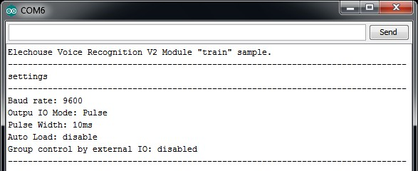

# Voice Recognition V2 **(WIP)**

## Feature
- Recognize maximum 7 voice commands at same time
- Store maximum 80 records of voice
- Group control and external group select pin
- Auto load records when power on
- Signature function, help to make out voice record
- LED indicate

## Terminology
- **record** -- voice command
- **recognizer** -- 
- **recognizer index**
- **train**
- **load**
- **signature**
- **group**

## Introduce

## Quick Start

### Prepare
+ [Voice Recognition V2][VRV2] module
+ [Arduino][Arduino] board ([UNO][UNO] recommended)
+ [Arduino Sensor Shield V07][SensorShieldV7]
+ [Arduino IDE][ArduinoIDE]
+ Voice Recognition V2 library([Download zip file][dzip])
+ [Access Port][accessport]

### Train
1. Connect your Voice Recognition V2 Module with Arduino, By Default:  

1. Download VoiceRecognitionV2 library.(download [zip][dzip] file or use `git clone https://github.com/elechouse/VoiceRecognitionV2.git` command)
1. When use zip format file, extract **VoiceRecognitionV2.zip** to `Arduino Sketch\libraries` folder, or if you use `git clone` command copy **VoiceRecognitionV2** to `Arduino Sketch\libraries` .
1. Open **vr\_sample\_train**(File -> Examples -> VoiceRecognitionV2 -> vr\_sample\_train)
1. Choose right Arduino board(Tool -> Board, UNO recommended), Choose right serial port.
1. Click **Upload** button, wait until Arduino is uploaded.
1. Open **Serial Monitor**. Set baud rate 115200, set send with **Newline** or **Both NL & CR**.  

1. Send command `settings`(case insensitive) to check Voice Recognition Module settings. Input `settings`, and hit `Enter` to send.  

1. Train Voice Recognition Module. Send `sigtrain 0 On` command to train record 0 with signature "On". When Serial Monitor prints "Speak now", you need speak your voice(can be any word, meaningful word recommended, may be 'On' here), and when Serial Monitor prints "Speak again", you need repeat your voice again. If these two voice are matched, Serial Monitor prints "Success", and "record 0" is trained, or if are not matched, repeat speaking until success.  
**When training, the two led on the Voice Recognition Module can benefit your training process. After send `train` command, the SYS_LED is blinking which remind you to be ready, then speak your voice as soon as the STATUS_LED lights on, the record finishes once when the STATUS_LED lights off. Then the SYS_LED is blinking again, these status repeated, when the training is successful, SYS_LED and STATUS_LED blink together, if training is failed SYS_LED and STATUS_LED blink together quickly.**  
  

1. Train another record. Send `sigtrain 1 Off` command to train record 1 with signature "Off". Choose your favorite words to train (it can be any word, meaningful word recommended, may be 'Off' here).  

1. Send `load 0 1` command to load voice. And say your word to see if the Voice Recognition Module can recognize your words.  

	If the voice is recognized, you can see.  
	
1. Train finish. Train sample also support several other commands.  

### Application

#### Control LED Sample
1. Open **vr\_sample\_control\_led**(File -> Examples -> VoiceRecognitionV2 -> vr\_sample\_control\_led)
1. Choose right Arduino board(Tool -> Board, UNO recommended), Choose right serial port.
1. Click **Upload** button, wait until Arduino is uploaded.
1. Open **Serial Monitor**. Set baud rate 115200.
1. Say your trained voice to control the LED on Arduino UNO board. When record 0 is recognized, the led turns on. When record 1 is recognized, the led turns off.  

1. Control led finish.

### Multi Command sample

## Protocol
The simplest way to play the Voice Recognition V2 module is to use this VoiceRecognition Arduino library. But for many **hackers**, this is far from enough, so we supply this protocol by which user can communicate with the Voice Recognition V2 module.

### Frame Format

#### Control
**| Head (0AAH) | Length| Command | Data | End (0AH) |**  
Length = L(Length + Command + Data)

#### Return
**| Head (0AAH) | Length| Command | Data | End (0AH) |**  
Length = L(Length + Command + Status +Data)

### Code

***ALL CODE ARE HEXADECIMAL***

---  
***FRAME CODE***  
**AA** --> Frame Head  
**0A** --> Frame End  

---
***CHECK***  
**00** --> [Check System Settings][id00]  
**01** --> [Check Recognizer][id01]  
**02** --> [Check Record Train Status][id02]  
**03** --> [Check Signature of One Record][id03]

---
***SYSTEM SETTINGS***  
**10** --> [Restore System Settings][id10]  
**11** --> [Set Baud Rate][id11]  
**12** --> [Set Output IO Mode][id12]  
**13** --> [Set Output IO Pulse Width][id13]   
**14** --> [Reset Output IO][id14]  
**15** --> [Set Power On Auto Load][id15]   

---
***RECORD OPERATION***  
**20** --> [Train One Record or Records][id20]  
**21** --> [Train One Record and Set Signature][id21]  
**22** --> [Set Signature for Record][id22]  

---
***RECOGNIZER CONTROL***  
**30** --> [Load a Record or Records to Recognizer][id30]  
**31** --> [Clear Recognizer][id31]  
**32** --> [Group Control][id32]

---
***THESE 3 COMMANDS ARE ONLY USED FOR RETURN MESSAGE***  
**0A** --> [Prompt][id0a]  
**0D** --> [Voice Recognized][id0d]  
**FF** --> [Error][idff]  

### Details

[id00]: #check-system-settings-00
#### Check System Settings (00)

[id01]: #check-recognizer-01
#### Check Recognizer (01)

[id02]: #check-record-train-status-02
#### Check Record Train Status (02)

[id03]: #check-signature-of-one-record-03
#### Check Signature of One Record (03)
[id10]: #restore-system-settings-10
#### Restore System Settings (10)

[id11]: #set-baud-rate-11
#### Set Baud Rate (11)

[id12]: #set-output-io-mode-12
#### Set Output IO Mode (12)

[id13]: #set-output-io-pulse-width-13
#### Set Output IO Pulse Width (13)

[id14]: #reset-output-io-14
#### Reset Output IO (14)

[id15]: #set-power-on-auto-load-15
#### Set Power On Auto Load (15)

[id20]: #train-one-record-or-records-20
#### Train One Record or Records (20)

[id21]: #train-one-record-and-set-signature-21
#### Train One Record and Set Signature (21)

[id22]: #set-signature-for-record-22
#### Set Signature for Record (22)

[id30]: #load-a-record-or-records-to-recognizer-30
#### Load a Record or Records to Recognizer (30)

[id31]: #clear-recognizer-31
#### Clear Recognizer (31)

[id32]: #group-control-32
#### Group Control (32)

[id0a]: #prompt-0a
#### Prompt (0A)

[id0d]: #voice-recognized-0d
#### Voice Recognized (0D)

[idff]: #error-ff
#### Error (FF)

## **Buy** ##
 

[accessport]: http://www.sudt.com/en/ap/       "AccessPort"

[ArduinoIDE]: http://arduino.cc/en/main/software "Arduino IDE"

[SensorShieldV7]: http://www.elechouse.com/elechouse/index.php?main_page=product_info&cPath=74&products_id=2211

[UNO]: http://arduino.cc/en/Main/arduinoBoardUno

[VRV2]: http://www.elechouse.com

[Arduino]: http://arduino.cc/en/

[dzip]: https://github.com/elechouse/VoiceRecognitionV2/archive/master.zip
